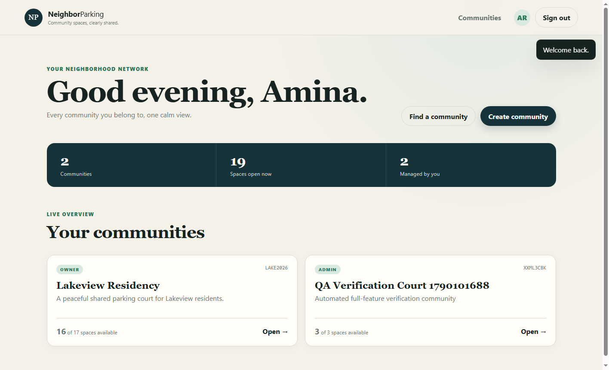

# NeighborParking

NeighborParking is a private, real-time parking availability platform for apartments, housing societies, offices, and other closed communities. Approved members share one live visual map, check in when arriving, and check out when leaving. Community owners and administrators manage access, design the parking grid, and resolve forgotten or incorrect occupancy.

The project is a complete Go web application: the backend, WebSocket hub, and responsive frontend are served from one binary.



## Highlights

- Secure account registration and revocable cookie sessions
- Multi-community dashboard with independent `OWNER`, `ADMIN`, and `MEMBER` roles
- Private community discovery and moderated join requests
- Role-sensitive member and occupant privacy
- Visual grid designer for parking, roads, gates, walls, pillars, and no-parking cells
- Real-time, community-scoped WebSocket updates
- Transaction-safe self check-in/check-out and administrator overrides
- Per-slot Go mutexes plus authoritative MySQL row locks and uniqueness constraints
- Buffered audit channel with a background worker pool and graceful draining
- Ownership transfer, promotion/demotion, removal, banning, leaving, and access revocation
- Responsive, accessible classic-modern interface with no frontend build step

For first-time GitHub publishing, everyday commits, branches, rollback commands, releases, and secret-safety practices, see [GITHUB_COMMIT_GUIDE.md](./GITHUB_COMMIT_GUIDE.md).

## Technology

- Go 1.24+
- MySQL 8.0+
- `database/sql` with `go-sql-driver/mysql`
- Gorilla WebSocket
- Server-embedded HTML, CSS, and JavaScript
- Docker Compose

## Quick start with Docker

Prerequisites: Docker Desktop with Compose.

```powershell
docker compose up --build -d
```

Open <http://localhost:8080>, register an account, create a community, and design its grid.

To create the included demo scenario, run the seed command from the host after MySQL starts:

```powershell
$env:DATABASE_URL='neighborparking:neighborparking@tcp(127.0.0.1:3307)/neighborparking?parseTime=true&charset=utf8mb4&collation=utf8mb4_unicode_ci'
& 'C:\Program Files\Go\bin\go.exe' run ./cmd/seed
```

Demo credentials all use `DemoPass123!`:

| Purpose | Email | Current access |
|---|---|---|
| Seed owner | `owner@demo.local` | Owner of Lakeview Residency; administrator of the QA community |
| Seed administrator | `admin@demo.local` | Administrator of Lakeview Residency |
| Seed member | `member@demo.local` | Approved Lakeview member with the seeded active booking |
| Seed applicant | `pending@demo.local` | Pending Lakeview applicant |
| QA member | `test.member2@demo.local` | Approved Lakeview member; owner of the active QA community |
| QA member | `test.outsider@demo.local` | Approved Lakeview member |

The final two accounts are persistent test fixtures created by the end-to-end verifier. The seeded map contains available and occupied parking spots, structural cells, an owner, an administrator, a member, and a pending request.

## Run without Docker

1. Install and start MySQL 8.
2. Create a database and application user.
3. Apply [migrations/001_init.up.sql](./migrations/001_init.up.sql).
4. Copy `.env.example` to `.env` and change `DATABASE_URL` for the local MySQL instance.
5. Run:

```powershell
.\scripts\run.ps1
```

The PowerShell scripts detect Go at `C:\Program Files\Go\bin\go.exe` when it is not yet available on `PATH`.

## Configuration

| Variable | Default | Purpose |
|---|---|---|
| `APP_ENV` | `development` | Runtime environment label |
| `HTTP_ADDR` | `:8080` | HTTP listen address |
| `DATABASE_URL` | required | MySQL DSN |
| `SESSION_TTL` | `168h` | Login-session lifetime |
| `COOKIE_SECURE` | `false` | Must be `true` behind production HTTPS |
| `ALLOWED_ORIGIN` | `http://localhost:8080` | Accepted browser and WebSocket origin |
| `AUDIT_WORKERS` | `2` | Audit-writing goroutines |
| `AUDIT_BUFFER` | `256` | Buffered audit-channel capacity |
| `SHUTDOWN_TIMEOUT` | `10s` | Graceful shutdown window |

## Architecture

```text
Browser UI
  ├─ REST snapshot/actions ──> HTTP handlers ──> domain checks ──> MySQL transactions
  └─ WebSocket subscription <─ community hub <─ committed occupancy/layout events
                                                    │
HTTP actions ──> buffered audit channel ──> worker goroutines ──> audit_logs
```

Important design decisions:

- MySQL is the source of truth. WebSockets notify clients, which refetch authoritative snapshots after connection or reconnection.
- A local per-slot mutex reduces duplicate work, while MySQL row locks and generated unique guards ensure correctness across multiple requests and server processes.
- Static structural cells live in layout JSON. Parking-slot identity and live occupancy remain relational. The API merges both into the one map seen by users and admins.
- Occupancy history stores vehicle snapshots, so historical records remain understandable after profile changes.
- Sensitive member fields are removed by server-side serializers for regular members.

## Repository layout

```text
cmd/api                 application entry point
cmd/seed                deterministic demo-data command
cmd/verify              repeatable full-stack API and WebSocket verification
internal/audit          buffered audit worker pool
internal/config         validated environment configuration
internal/domain         domain and API models
internal/httpapi        routes, middleware, handlers, embedded UI
internal/parking        keyed slot-lock manager
internal/platform       IDs, normalization, and typed application errors
internal/realtime       WebSocket hub and client pumps
internal/store          MySQL queries and business transactions
migrations              versioned MySQL schema
scripts                 Windows helpers and headless browser verification
docs                    OpenAPI contract and verification screenshots
```

## API and WebSockets

The HTTP API is under `/api/v1`. See [docs/openapi.yaml](./docs/openapi.yaml) for the route contract.

WebSocket clients connect to `/api/v1/ws/communities/{communityId}` using their authenticated session cookie. The server verifies approved membership, isolates subscriptions by community, applies ping/pong deadlines, bounds client queues, and drops slow clients.

Events include:

- `SLOT_OCCUPIED`
- `SLOT_RELEASED`
- `LAYOUT_UPDATED`
- `ACCESS_REVOKED`

## Verification

Start the Docker stack and seed it before running the end-to-end commands. Run unit tests and static analysis with:

```powershell
.\scripts\test.ps1
```

Run the Go race detector where CGO is available:

```powershell
& 'C:\Program Files\Go\bin\go.exe' test -race ./...
```

Tests cover slot-lock serialization, independent locks, layout validation, identifier/token behavior, normalization, and audit-queue draining. Database correctness is additionally enforced by MySQL transactions, foreign keys, checks, and unique generated guards.

Run the repeatable full-stack verifier against the live application:

```powershell
& 'C:\Program Files\Go\bin\go.exe' run ./cmd/verify
```

It exercises authentication, profile updates, community privacy and discovery, join decisions, member privacy, role changes, ownership transfer, multi-community isolation, grid version conflicts, administrator overrides, one-active-space enforcement, simultaneous booking contention, history preservation, access revocation, ban/unban, leaving, audit-producing actions, and community-scoped WebSocket delivery.

Run the real-browser journey in installed Microsoft Edge:

```powershell
node .\scripts\browser-verify.mjs
```

It checks login, dashboard rendering, the live map and WebSocket indicator, member/request/designer tabs, profile and logout flows, JavaScript exceptions, and a 390 px mobile viewport. Evidence is saved as [dashboard](docs/screenshots/dashboard.png), [live map](docs/screenshots/live-map.png), and [mobile login](docs/screenshots/mobile-login.png) screenshots.

## Production checklist

Before public deployment:

- Place the app behind HTTPS and set `COOKIE_SECURE=true`.
- Use strong, managed database credentials and a non-root MySQL account.
- Run migrations as an explicit deployment step.
- Configure database backups and restore drills.
- Add reverse-proxy request limits and platform-level rate limiting.
- Send structured logs and health checks to monitoring.
- Upgrade the in-memory audit queue and WebSocket event publication to a transactional outbox/distributed broker before horizontal scaling.
- Perform deployment-specific security, load, accessibility, and browser testing.

## Current MVP boundaries

This release intentionally does not implement payments, future reservations, geofencing, cameras, IoT sensors, native mobile apps, or multiple vehicles per user. These are documented extension points rather than incomplete UI controls.
